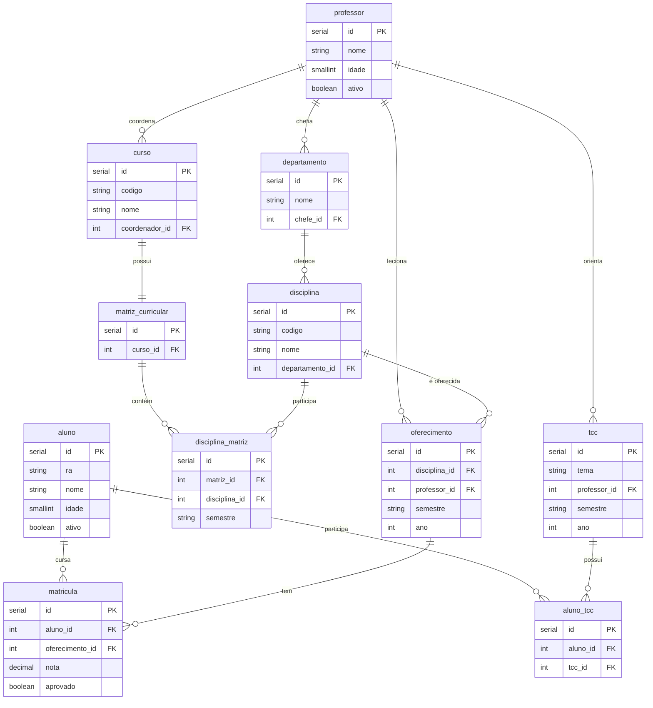

# Sistema de Banco de Dados Universitário

## Sobre o Projeto

Este projeto implementa um sistema de banco de dados para gerenciamento universitário que armazena e manipula informações sobre alunos, professores, departamentos, cursos, disciplinas, históricos escolares e TCCs. O banco de dados utilizado foi o Supabase, baseado no postgres, e a parte da aplicação de população e validação de dados foi feita em dotnet com C#.

### Participantes

Willian Verenka RA 22.124.081-5

## Preparando o projeto
Certifique-se de que tem o [dotnet 9 SDK instalado.](https://dotnet.microsoft.com/pt-br/download/dotnet/9.0)

Caso esteja tudo certo, `dotnet --list-sdks` deve mostrar a versão correta do SDK.

Clone o projeto pelo terminal ou IDE de preferência. Pelo terminal:

`git clone https://github.com/willianverenka/banco-universitario.git`

## Conectando com o seu banco

Navegue até a raíz do projeto:
`cd cd banco-universitario/`

1. Abra o arquivo "appsettings.json" em seu editor de texto de preferência
2. Navegue até o supabase e entre na página da sua database.
3. Clique no botão do topo "Connect"
4. Troque o tipo para .NET e copie o valor mostrado no campo "DefaultConnection"
   

      

5. Substitua o conteúdo desse campo

## Preparando seu banco

Antes de executarmos a aplicação, o seu banco de dados deve conter as tabelas do projeto. Você deve executar o conteúdo do arquivo "init.sql" no seu postgres ou supabase para inicializar o schema adequado.

## Executando a aplicação

Com a conexão do banco configurada e com as tabelas prontas, navegue até o source code:

`cd src/`

Execute o projeto:

`dotnet run`

A aplicação abrirá conexão com o seu banco e fará a inserção dos dados fictícios de forma automática. Cada linha de inserção é logada na mesma janela de execução e o programa é parado após a inserção dos dados.

Quando finalizado, você pode visualizar as queries no arquivo "queries.sql", que está uma subpasta acima: `cd ..` e executar na sua plataforma para visualizar os dados. 

Para queries que são arbitrárias, isto é, mostra a relação de um único usuário, sua escolha é feita com base no primeira entrada da tabela em questão.

## Diagramas

